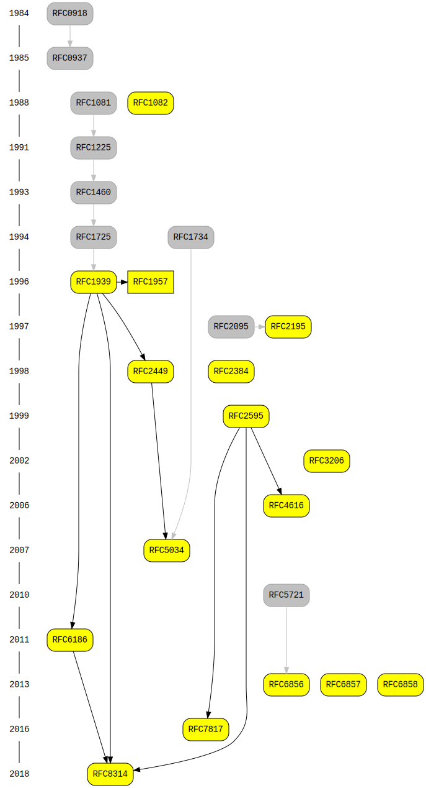

# POP3 Protocol

This crate provides types and parsers for POP3 commands. Responses are not implemented yet.

# Overview of (all?) RFCs related to POP3

Made with https://github.com/raybellis/rfcdeps

# License

This crate is dual-licensed under Apache 2.0 and MIT terms.
